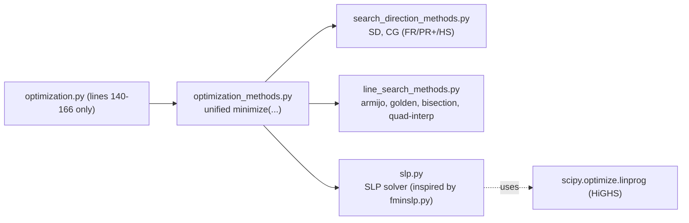
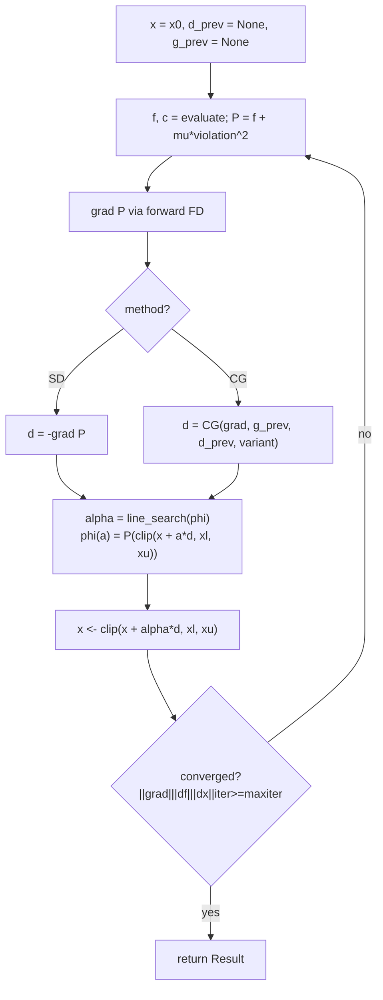

## 1. Scope & constraints

- **Only** edit lines 140-166 of [05_OPTI/optimization.py](05_OPTI/optimization.py). Everything above that (problem definition, FD step, `evaluate_model`, `objective`, `constraints`, `logger`, `cache`) stays exactly as-is.
- `evaluate_model` already caches per-`x` and `logger.log_evaluation(...)` already records every FEA call from inside it — so **any** solver that calls `objective(x)` / `constraints(x)` automatically logs correctly. No logger surgery needed.
- Sign convention notes (critical, easy to get wrong):
  - Current problem uses **PySLSQP convention**: `c(x) >= 0` means feasible.
  - `fminslp.py` uses the **opposite**: `g(x) <= 0` means feasible.
  - Our new modules will use **PySLSQP convention everywhere** (`c(x) >= 0` feasible) so no signs flip in `optimization.py`. The SLP solver internally converts to the LP standard form.

## 2. New file layout (in `05_OPTI/`)



## 3. `line_search_methods.py` — find step length alpha along `phi(alpha) = f(x + alpha*d)`

All functions are **stateless** and take a callable `phi` (scalar-in, scalar-out). This keeps them trivially testable on toy problems and agnostic to the outer solver.

Planned API:

```python
def armijo_backtracking(phi, phi0, dphi0, alpha0=1.0, c1=1e-4, rho=0.5, max_iter=50): ...
def golden_section(phi, a, b, tol=1e-5, max_iter=100): ...
def bisection(phi, a, b, tol=1e-5, max_iter=100, fd_h=1e-4): ...     # bisects phi' via central FD
def quadratic_interpolation(phi, phi0, dphi0, alpha0=1.0, max_iter=20, alpha_min=1e-10): ...
```

- **Armijo (inexact)**: classic backtracking satisfying `phi(alpha) <= phi0 + c1*alpha*dphi0`. Reference: Nocedal & Wright, *Numerical Optimization* (2e), Algorithm 3.1.
- **Golden section**: bracket `[a, b]` then shrink with ratio `(sqrt(5)-1)/2`. Reference: Arora, *Introduction to Optimum Design*, §10.5; Rao, *Engineering Optimization*, §5.7.
- **Bisection**: brackets a zero of `phi'(alpha)` inside `[a, b]`; derivative via central FD (`fd_h`), so costs 2 evals per step. Reference: Arora §10.6.
- **Quadratic interpolation**: fit a quadratic through `phi(0)`, `phi'(0)`, `phi(alpha0)` and jump to its minimizer, with safeguarding and simple Armijo acceptance. Reference: N&W §3.5 "Interpolation".

A common bracketing helper (`_bracket(phi, alpha0=1.0)` doubling until `phi` rises) will be used by `golden_section`/`bisection` when called without an explicit bracket.

## 4. `search_direction_methods.py` — compute descent direction `d`

Tiny pure functions, no state:

```python
def steepest_descent(grad):
    return -grad

def conjugate_gradient(grad, grad_prev, d_prev, variant="PR+", restart_every=None, iter_k=0):
    # variants: "FR" (Fletcher-Reeves), "PR" (Polak-Ribiere),
    #          "PR+" (default, beta = max(0, beta_PR); auto-restart on negativity),
    #          "HS" (Hestenes-Stiefel)
    # Periodic restart every n iterations if restart_every is set.
    return d
```

References: N&W §5.2 (FR), §5.2 Table 5.4 and eq. 5.44 (PR, PR+, HS); Rao §6.9; Arora §11.4.

## 5. `optimization_methods.py` — unified driver (the thing `optimization.py` calls)

Single public entry point:

```python
def minimize(
    obj, con, x0, xl, xu,
    method="steepest_descent",        # "steepest_descent" | "conjugate_gradient" | "slp"
    line_search="armijo",             # "armijo" | "golden" | "bisection" | "quadratic"
    fd_step=None, fd_type="forward",  # per-variable step vector (matches current fd_step_options)
    maxiter=40,
    gtol=1e-6, ftol=1e-3, xtol=1e-8,
    penalty_weight=1e3,               # SD/CG only: mu in exterior quadratic penalty
    cg_variant="PR+",
    ls_options=None,                  # dict forwarded to the chosen line search
    callback=None,
) -> Result
```

`Result` is a small dataclass: `x, fun, nit, nfev, success, message, history`.

### 5.1 MVP constraint handling for SD/CG (per your choice)

Exterior quadratic penalty + **clipping to bounds** after each step. That's it.

For the PySLSQP convention `c_i(x) >= 0`, the violation is `max(0, -c_i(x))`. So:

```
P(x; mu) = f(x) + mu * sum_i ( max(0, -c_i(x)) )**2
```

Gradient of P via per-variable forward FD using `fd_step` (reusing the existing cache in `evaluate_model` — one FD perturbation = 1 extra FEA call, same cost model as PySLSQP today). Bounds are enforced purely by `x_{k+1} = clip(x_k + alpha*d_k, xl, xu)` (projected step). No penalty on bounds — cheaper and simpler.

Outer loop is just the unconstrained minimization of `P`; `mu` is **fixed** (user-tunable, default `1e3`). No augmented Lagrangian, no mu ramp — true MVP.

### 5.2 Inner loop (SD / CG)



Key note: `phi(alpha)` internally **clips** before evaluating, so the line search never steps outside the box. This is a standard and simple projected line-search recipe.

### 5.3 `method="slp"` branch

Dispatches straight to `slp.solve_slp(obj, con, x0, xl, xu, fd_step=fd_step, maxiter=maxiter, ...)` and wraps its return in the same `Result` shape so the caller doesn't care which method was used.

## 6. `slp.py` — Sequential Linear Programming (inspired by `fminslp.py`)

Goal: **simpler** than `fminslp.py` but same bones. Keep move-limit trust region + slack variables for robustness to initial infeasibility; drop the global convergence filter and augmented-Lagrangian variant for MVP.

### 6.1 Per-iteration LP subproblem

At iterate `x_k`, with FD gradients `g = ∇f(x_k)` and `A = ∇c(x_k)` (shape `m x n`, PySLSQP convention `c(x) >= 0`):

Linearize: `c(x) ≈ c_k + A (x - x_k) >= 0`  ⇒  `-A dx <= c_k`.
With slacks `s_i >= 0` to allow controlled infeasibility and step `dx = x - x_k`:

```
min_{dx, s}   g · dx  +  M * sum(s)
s.t.          -A dx - s  <=  c_k              # linearized inequalities, with relaxation
              xL_trust - x_k  <=  dx  <=  xU_trust - x_k
              s >= 0
```

Solved by `scipy.optimize.linprog(method="highs")`. `M` is the `InfeasibilityPenalization` (default `1e3`).

### 6.2 Trust region / move limits

Reuse the **adaptive move-limit recipe** from [05_OPTI/fminslp.py:815-889](05_OPTI/fminslp.py): oscillation detection via the sign of `(xold1 - xold2) / (x - xold1)` decides expand vs. reduce. This is already battle-tested in the file; we will port a trimmed version of that function into `slp.py` (same math, no slacks-box handling).

### 6.3 Acceptance & convergence

Simple acceptance (no filter): accept step if `P(x_{k+1}) < P(x_k)` where
`P(x) = f(x) + M * sum(max(0, -c_i(x)))`.
If rejected, shrink move limits and resolve LP. Stop on `||g||`, `|df|`, `||dx||`, or `maxiter`.

Planned public API:

```python
def solve_slp(
    obj, con, x0, xl, xu,
    fd_step=None, fd_type="forward",
    maxiter=40, move_limit=0.1,
    move_limit_reduce=0.5, move_limit_expand=1.1,
    infeasibility_penalty=1e3,
    gtol=1e-6, ftol=1e-3, xtol=1e-8,
) -> Result
```

## 7. Replacement for [optimization.py:140-166](05_OPTI/optimization.py)

After all four new files exist, the only edit in `optimization.py` becomes:

```python
from optimization_methods import minimize

result = minimize(
    obj=objective,
    con=constraints,
    x0=x0,
    xl=xl,
    xu=xu,
    method="steepest_descent",        # swap to "conjugate_gradient" or "slp" to compare
    line_search="armijo",             # swap among "armijo"|"golden"|"bisection"|"quadratic"
    fd_step=fd_step,
    fd_type="forward",
    maxiter=maxiter,
    ftol=acc,
    penalty_weight=1e3,
)
return result, logger.txt_path, logger.csv_path
```

No other line in the file moves. The `save_folder`, filenames, and logger keep working because they're tied to `evaluate_model` and `OptimizationLogger`, which are untouched.

## 8. References (for the write-up / docstrings)

- Nocedal & Wright, *Numerical Optimization*, 2nd ed., 2006 — Ch. 3 (line search: Armijo, Wolfe, interpolation), Ch. 5 (CG: FR, PR+, HS), Ch. 17 (penalty methods).
- Arora, *Introduction to Optimum Design*, 4th ed. — §10.5–10.7 (golden section, bisection, polynomial interpolation), §11.4 (CG).
- Rao, *Engineering Optimization: Theory and Practice*, 5th ed. — §5.7 (golden section), §6.9 (CG), Ch. 7 (SLP).
- Haftka & Gürdal, *Elements of Structural Optimization*, 3rd ed. — Ch. 9 (SLP with move limits for structural sizing).
- The MATLAB `fminslp` package this codebase already mirrors in [05_OPTI/fminslp.py](05_OPTI/fminslp.py) — move-limit and slack-relaxation ideas come from there.

## 9. Out of scope (explicitly)

- No changes to `evaluate_model`, `cache`, `OptimizationLogger`, `Post_Process.py`, or `MyAPDLCall.py`.
- No `visualize=True` equivalent plotting; that was PySLSQP-specific. The CSV + TXT logs still capture history.
- No HDF5 `pyslsqp_history.hdf5`; the existing CSV `objective_history_*.csv` and TXT log cover history for the custom solvers.
